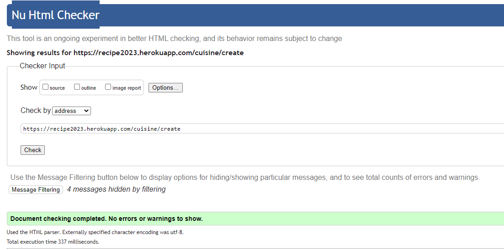

#  Recipe App

 This ia a  recipe app that utilizes a full-stack framework including Django, Python, HTML, and CSS. The app is designed to enable users to easily create, add, edit, and comment on recipes, and the website is fully responsive and functional.

**Developer: Antony Maina**

[Visit live website](https://recipe2023.herokuapp.com/)

## Table of Contents
1. [About](#about)
  
2. [UX](#ux)
    - [User Stories](#user-stories)

3. [Scope](#scope)
    - [Features](#features)
    - [Future Features](#future-features)

4. [Wireframes](#wireframes)

5. [Database schema](#database-schema)

6. [Surface](#surface)

7. [Technologies Used](#technologies-used)

8. [Testing](#testing)
    - [user story testing](#user-story-testing)
    - [Automated testing](#automated-testing)
    - [Performing tests on various devices](#performing-tests-on-various-devices)
    - [Browser compatibility](#browser-compatibility)

9. [Validation](#validation)

10.  [Bugs](#bugs) 

11. [Deployment](#deployment)
  - [Forking the GitHub Repository](#forking-the-github-repository)
  - [Making a Local Clone](#making-a-local-clone)

12. [Credits](#credits)

# About
My recipe app in Django is a great way to organize and share recipes online.The app typically includes features such as the ability to create, read, update and delete (CRUD) recipes
The recipe app is usually designed with a user-friendly interface that allows users to easily navigate through the app and find the recipes they are interested in. It can also include additional features such as creating profiles and leaving comments.

# UX
* The recipe app has a user friendly interface i.e it is easy to use and navigate through easily.
* I used a simple and visually appealing design.
* I personalizes the app by creating user profiles and ability to update pictures.
* There i also user feedback by leaving comments of the cuisine.
* There are also instructions on which type of ingredients and description of the cuisines.

## User Stories 

**Admin**
- As a Site admin I can view contact comments so that i can make my cusine site more appealing to user
- As a site Admin I can create, edit and delete recipes and comments so that I can manage the site content
- As a Site admin I can log in admin dashboard so that i can edit cuisines/comments/profiles
- As a site Admin I can log out of the admin panel so that I can disconnect from the website

**Site User**
- As a Site user  I can see if i'm logged in or out  so that i can see what my status is
- As a Site user I can write comments on recipes so that I can leave my feedback
- As a Registered user I can edit my profile so that i can update my personal information
- As a Registered user I can view my profile so that i can manage my personal information
- As a Site user I can delete my comment so that i can correct a mistake made
- As a Site user I can see the ingredients so that i can see what i should buy to make a recipe
- As a Site user I can create a recipe so that i can contribute and get feedback from my skills
- As a Site User I can register an account so that i can view recipes
- As a Site user I can comment on the cuisine so that i can share my thoughts with others
- As a Site user I can easily navigate through the site so that i can view the desired content

#
# Scope 

## **Features**
### **Home Page**
*Navigation bar:* 
- The navigation bar appears on every page so users can easily navigate through the site
- Navigation bar has links for 'Home', 'About', 'Add cuisines', 'Contact', 'profile', 'login'  and 'Register'
- When the user is logged in the users 'Profile' and 'Logout' link apppear
- When the user registers a placeholder image appears and the user can add a picture at any time.
- The navbar is fully responsive, collapsing into a hamburger menu for medium and small screen size

<p align="center">

</p>


*Hero Carusell:*
- The hero carusell shows the user what the app ias about and the variuos type of cusines on the app.

<p align="center">

</p>

*Recipe/Cuisine:*
Just below the carusell are the recipes that have be created by the user or by the admin.
- At the top we have the 'author'
- Description about the recipe comes at the second position
- Ingredients about the recipe comes at the third position
- Created on date of the recipe is also visualized in this section.
- The view cuisine button is at the bottom of the card ab when clicked directs us to the comment section

<p align="center">

</p>

*Comments section*
- Only logged in users can comment on a recipe
- logged in users can only delete their own comments.
- Admin can also delete comments.

<p align="center">

</p>


### **About Page**
- The page highlights the team's goal to inspire and encourage people to get creative in the kitchen by providing a recipe menu that is accessible to everyone, regardless of their skill level. 
- The team emphasizes the importance of making cooking fun and enjoyable for everyone and hopes that their website will inspire people to try new and exciting dishes.
- Overall, the "about us" page is intended to provide a brief introduction to the team's philosophy and approach to cooking, and to encourage visitors to explore the recipe menu and try out some of the team's favorite dishes

<p align="center">

</p> 

### **Add a cuisine**
- This is the main page of the logged in user.
- User can a add a title about the recipe he/she wants to create
- User can add a description abou the recipe
- User can add ingredients about the recipe 
- User can add image of the recipe
- when the user saves the image it it highlighted in the home page

<p align="center">

</p> 

### **Contact Us**

- The contact us page in this recipe app is typically a way for users to get in touch with the admin . 
- It is a separate page that contains contact information i.e Name, Email and Subject.
- It has a submit button which directs the message to the admin of the app.

<p align="center">

</p> 

### **Profile**
- In this section the user can see their logged in status
- in this section the user can edit the placeholder image and update their own

<p align="center">

</p> 

### **Login/Register**
- The Register button takes users to the login page where they can also find a link to the Register page where they can create an account
- when a user is logged in the logout button dynamically appears to show the status of the user.

<p align="center">

</p> 

### **Footer**
- Appears on every page and contains social media links
- Links are opened in a new tab to avoid dragging users from our site

<p align="center">

</p> 

# Wireframes
All wireframes were created used [Balsamiq](https://balsamiq.com/)

Wireframes for each device are linked here:
- [Balsamiq wireframes](assets/documents)

# Database schema

<p align="center">

</p>

## Models
### **Cuisine Model**
<p align="center">

</p>

### **Contact Model**
<p align="center">

</p>

### **Profile Model**
<p align="center">

</p>

### **Comment Model**
<p align="center">

</p>

# Surface

## Design 
<p align="center">

</p>

# Technologies Used

## Languages 
- [HTML5](https://en.wikipedia.org/wiki/HTML5)
- [CSS3](https://en.wikipedia.org/wiki/CSS)
- [Python](https://www.python.org/)

## Frameworks, Libraries & Programs Used
[GitHub](https://github.com/) - Holds the repository of my project, GitHub connects to GitPod and Heroku.

[GitPod](https://gitpod.io/workspaces) – Connected to GitHub, GitPod hosted the coding space, allowing the project to be built and then committed to the GitHub repository. 

[Heroku](https://www.heroku.com/) - Connected to the GitHub repository, Heroku is a cloud application platform used to deploy this project so the backend language can be utilised/tested. 

[Django](https://www.djangoproject.com/) - This framework was used to build the foundations of this project

[Gunicorn](https://gunicorn.org/) - Gunicorn is a pure-Python HTTP server for WSGI applications.

[Dj Database URL](https://pypi.org/project/dj-database-url/) - This allows you to utilize the 12factor inspired DATABASE_URL environment variable to configure your Django application.

[Bootstrap](https://getbootstrap.com/) - Used to quickly add design to my website, Bootstrap focuses on mobile first design meaning this website is responsive across multiple devices ans screen sizes. 

[Cloudinary](https://cloudinary.com/?utm_source=google&utm_medium=cpc&utm_campaign=Rbrand&utm_content=492438439811&utm_term=cloudinary&gclid=Cj0KCQiAt8WOBhDbARIsANQLp96hTerzfFJ_P9lX0tEYEdtM3tSsYB6fhw-x3wQxOO0oc4hXm-A2ZBUaAptIEALw_wcB) - Used to for recipe images and picture profile

[Google Fonts](https://fonts.google.com/https://fonts.google.com/) - provide fonts for the website.

[Balsamiq](https://balsamiq.com/) - was used to create site wireframes.

[Unsplash](https://unsplash.com/) - were used for all the images

[W3C Markup Validator](https://validator.w3.org/#validate_by_input) - was used to validate HTML

[W3C CSS Validator](https://jigsaw.w3.org/css-validator/) - was used to validate CSS

[Coolors](https://coolors.co/9df57a-3c444c-fee73b-ff4f98-2daaf3-a9bedb) - to make color palette

[Chrome dev tools](https://developers.google.com/web/tools/chrome-devtools/) was used for debugging of the code and checking site for responsiveness

[jQuery](https://jquery.com) was used for drop-down exercises filters on smaller screens

[Elephant SQL](https://www.elephantsql.com/) – deployed project on Heroku uses an Elephant SQL database

- Validation:
  - [WC3 Validator](https://validator.w3.org/) was used to validate the html in the project
  - [Jigsaw W3 Validator](https://jigsaw.w3.org/css-validator/) to validate the css in the project
  - [JShint](https://jshint.com/) for JavaScript quality
  - [Lighthouse](https://developers.google.com/web/tools/lighthouse/) for performance, accessibility, progressive web apps, SEO analysis of the project code

#

# Testing

# User Story Testing

1. As a site user, I can create an account to interact with recipes

| **Step** | **Expected Result** | **Actual Result** |
|---|---|---|
| Navigate to https://recipe2023.herokuapp.com/register/ and fill registration form | account is created for the user | Works as expected |

2. As a Site user I can see if i'm logged in or out so that i can see what my status is

| **Step** | **Expected Result** | **Actual Result** |
|---|---|---|
| Navigate to https://recipe2023.herokuapp.com/profile/17/ | logged in status is seen | works as expected | 

3. As a Site user I can write comments on recipes so that I can leave my feedback

| **Step** | **Expected Result** | **Actual Result** |
|---|---|---|
| Navigate to https://recipe2023.herokuapp.com/20/add-comment/ | feeddback form is displayed | works as expected |

4. As a Registered user I can edit my profile so that i can update my personal information

| **Step** | **Expected Result** | **Actual Result** |
|---|---|---|
| Navigate to https://recipe2023.herokuapp.com/profile/edit/17/ | edit profile is displayed | works as expected |

5. As a Site user I can create a recipe so that i can contribute and get feedback from my skills

| **Step** | **Expected Result** | **Actual Result** |
|---|---|---|
| Navigate to https://recipe2023.herokuapp.com/cuisine/create | create profile is displayed | works as expected |

6. As a Site user I can delete my comment so that i can correct a mistake made

| **Step** | **Expected Result** | **Actual Result** |
|---|---|---|
| Navigate to https://recipe2023.herokuapp.com/cuisine/20 | delete button is displayed | works as expected |

7. As a site user, I can view the featured recipes on the home page

| **Step** | **Expected Result** | **Actual Result** |
|---|---|---|
| Navigate to https://recipe2023.herokuapp.com/ | homepage recipes displayed | works as expected |
| Navigate to https://recipe2023.herokuapp.com/ | navbar links displayed | works as expected |
| Navigate to https://recipe2023.herokuapp.com/ | footer links displayed | works as expected |

8. As a site admin, I can create, read, update and delete my recipes and articles to manage site content

**Step** | **Expected Result** | **Actual Result**
------------ | ------------ | ------------ |
 Navigate to https://recipe2023.herokuapp.com/admin/ |Admin dashboard is displayed | Works as expected |

9. As a Site admin I can view contact comments so that i can make my cusine site more appealing to user

| **Step** | **Expected Result** | **Actual Result** |
|---|---|---|
Navigate to https://recipe2023.herokuapp.com/admin/cuisine/comment/ | Admin view comment dashboard is diaplayed | works as expected |

10. As site admin i can delete and add profiles.

| **Step** | **Expected Result** | **Actual Result** |
|---|---|---|
| Navigate to https://recipe2023.herokuapp.com/admin/user/profile/ | Admin profile dashboard is displayed | works as expected |

11. As site admin i can add, delete and edit cuisines

| Step | Expected Result | Actual Result |
|---|---|---|
| Navigate to https://recipe2023.herokuapp.com/admin/cuisine/cuisine/ | Admin cuisine profile is displayed | works as expected |

12. As a site owner, I want to increase my social media presence

**Step** | **Expected Result** | **Actual Result**
------------ | ------------ | ------------ |
Navigate until bottom of page | Links bring user to social media page  | Works as expected |

# Automated testing

Automated testing was done using the Django's unit tests from a Python standard library module: unittest. 

# Performing tests on various devices

The website was tested using Google Chrome Developer Tools Toggle Device Toolbar to simulate viewports of different devices.

The website was tested on the following devices:
- MacBook Pro
- windows

## Validation

The W3C Markup Validation Service was used to validate the HTML of the website.
<details><summary>Home</summary>

</details>

<details><summary>Register</summary>

</details>

<details><summary>Login</summary>

</details>

<details><summary>Logout</summary>

</details>

<details><summary>cuisines</summary>

</details>

<details><summary>About</summary>

</details>

<details><summary>Create</summary>

</details>

<details><summary>Add Comment</summary>

</details>

<details><summary>Contact</summary>

</details>


### CSS Validation
The W3C Jigsaw CSS Validation Service was used to validate the CSS of the website. When validating all website, it passes with no errors.

<details><summary>Style.css</summary>

</details>

### JavaScript Validation
JSHint JS Validation Service was used to validate the Javascript files. 

<details><summary>Script.js</summary>

</details>

# Browser compatibility

- Testing has been carried out on the following browsers:
  - Google Chrome
  - Safari
  - Firefox
  - Microsoft Edge
  - Android Native Browser
  - Google Chrome on Android


## Bugs

| **Bug** | **Fix** |
| ------- | ------- |
| Profile picture was failing to load | used enctype="multipart/form-data" in edit_profile template and CloudinaryImageField in models |

## Future Considerations

| **Feature** | 
| ------- | 
| Ability of user to leave likes on recipes |
| Implement a search functionality to allow users to search for recipes by keywords, ingredients, or tags |

# Deployment
This project was deployed using Github and Heroku.

# Forking the GitHub Repository
1. Go to the GitHub repository
2. Click on Fork button in top right corner
3. You will then have a copy of the repository in your own GitHub account.
   
# Making a Local Clone
1. Go to the GitHub repository 
2. Locate the Code button above the list of files and click it
3. Highlight the "HTTPS" button to clone with HTTPS and copy the link
4. Open commandline interface on your computer
5. Change the current working directory to the one where you want the cloned directory
6. Type git clone and paste the URL from the clipboard 
  ```
  $ git clone https://github.com/maish79/food
  ```
7. Press Enter to create your local clone

## Credits

### Images

- Images used in this app were found on Unsplash
- ReadMe inspiration from John Constant and Iris Smok
- Stackoverflow, Django documentation.